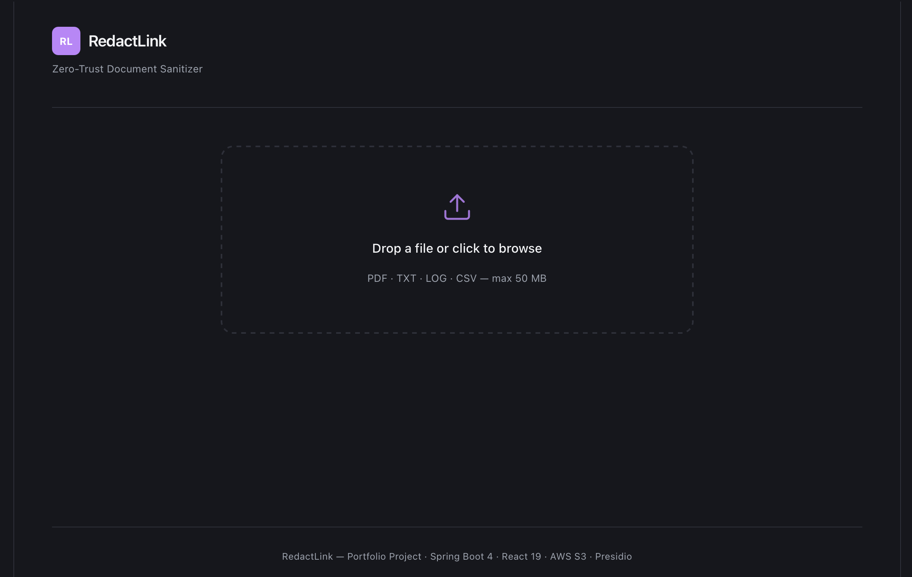
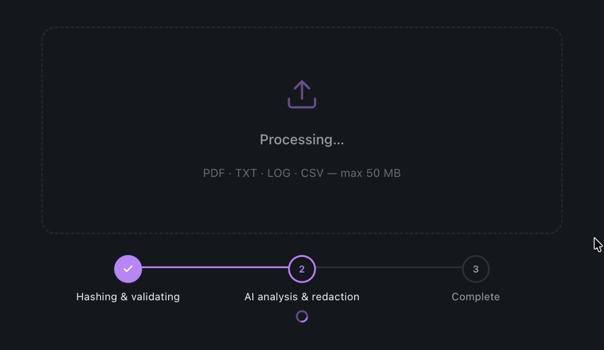
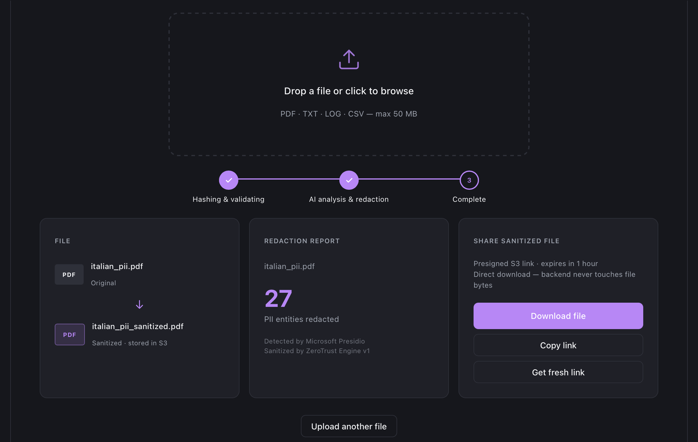
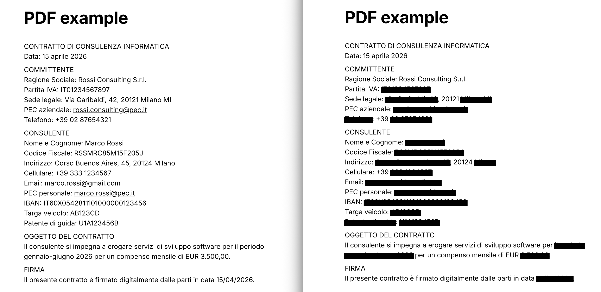
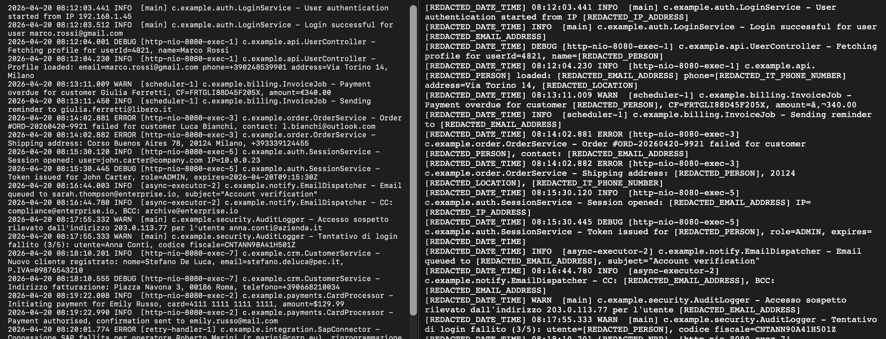

# RedactLink

**Zero-Trust Document Sanitizer & Secure Drop**

Upload a sensitive document, get back a clean one with every piece of PII physically removed, then share it via a short-lived signed link. Built around a real enterprise problem: files leaving organizations with unredacted emails, credit cards, names, and IPs baked in.

---

## What It Does

1. **Upload:** the browser computes a SHA-256 hash and requests a presigned S3 PUT URL. File bytes go straight to AWS; the backend never buffers them.
2. **Analyze:** the S3 event triggers an SQS message. A Spring Boot worker picks it up, extracts the text, then calls Microsoft Presidio to locate PII entities with their character offsets.
3. **Redact:** format-specific. PDFBox draws black bounding-box rectangles over the original PDF coordinates; TXT / CSV / LOG get index-based string replacement.
4. **Share:** the sanitized file is served via a short-lived S3 presigned GET URL and includes a redaction audit report embedded in the file itself.

---

## Architecture Highlights

| Pattern | Implementation |
|---|---|
| **No-proxy uploads** | Browser PUT directly to S3 via presigned URL. The backend issues credentials but never sees the bytes. |
| **Event-driven async** | S3 Event Notification feeds SQS, consumed by a Spring `@SqsListener`. The upload endpoint returns immediately. |
| **Idempotency** | SHA-256 dedup stored in Redis. Ten users uploading the same file trigger one processing job. |
| **Real-time push** | Server-Sent Events via Spring `SseEmitter`. The client opens an `EventSource` before the S3 PUT and receives a push when processing completes. Same protocol ChatGPT uses for token streaming. |
| **Rate limiting** | Redis sliding window counter: 5 uploads per hour per IP. |
| **Pluggable NLP** | Presidio runs as a Docker sidecar on port 5002. Swapping the analyzer requires no changes to the Spring pipeline. |
| **Audit trail** | For PDFs, redaction metadata is injected into document properties via PDFBox. For text files it is appended as a comment footer. |

---

## Tech Stack

| Layer | Technology |
|---|---|
| Frontend | React 19, TypeScript, Vite |
| Backend | Spring Boot 4, Java 21 |
| Cloud Storage | AWS S3 (two buckets: raw-uploads, sanitized-files) |
| Async Messaging | AWS SQS |
| Cache / Rate Limit | Redis (Upstash in production) |
| PII Detection | Microsoft Presidio (open-source NLP, Docker sidecar) |
| PDF Redaction | Apache PDFBox 3, coordinate-based bounding boxes |
| Text Redaction | Java String API, index-based range replacement |
| Real-time Updates | Server-Sent Events |
| Infrastructure | Docker Compose (local dev), AWS EC2 t2.micro (backend), Vercel (frontend) |

---

## Screenshots

### Upload
Drop a file or click to browse. The browser computes the SHA-256 before anything is sent.



### Processing
The three-step progress tracker updates in real time over SSE. Step 1 (hashing and validation) completes client-side; step 2 (AI analysis and redaction) reflects the async SQS worker.



### Result: redaction report and share panel
Once the worker finishes, the UI shows the original and sanitized filenames, the count of PII entities detected by Presidio, and the share panel with a presigned S3 link. The download goes directly from S3; the backend is never in the data path.



### Before and after: PDF
An Italian consulting contract. On the left, names, tax codes, addresses, IBANs, phone numbers, and emails are all visible. On the right, PDFBox has drawn black bounding-box rectangles over the exact text coordinates. The underlying bytes are gone, not just covered.



### Before and after: log file
On the left, a raw application log with IP addresses, emails, names, and locations inline. On the right, each entity replaced with a typed label (`[REDACTED_IP_ADDRESS]`, `[REDACTED_EMAIL]`, `[REDACTED_PERSON]`...) at the exact character offset Presidio returned.



---

## How It Works

### Upload and sanitization

```
React (browser)            Spring Boot               AWS               Presidio
      |                        |                      |                    |
      |-- SHA-256(file) -----> |                      |                    |
      |-- POST /request-url    |                      |                    |
      |                        |-- Redis: rate limit  |                    |
      |                        |-- Redis: SHA-256 dedup                    |
      |                        |-- S3 presign PUT URL |                    |
      |<-- {presignedUrl,      |                      |                    |
      |     fileId}            |                      |                    |
      |                        |                      |                    |
      |-- PUT file bytes ---------------------------> S3 (raw-uploads)     |
      |                        |                      |                    |
      |-- GET /updates/{id} -> | (SSE open)           |                    |
      |   EventSource          |                      |                    |
      |                        |          S3 Event -> SQS -> @SqsListener  |
      |                        |                      |                    |
      |                        | 1. Extract text      |                    |
      |                        |    (PDFBox / bytes)  |                    |
      |                        |                      |                    |
      |                        | 2. POST /analyze --------------------------------> |
      |                        |                      |         [{type, start, end}] |
      |                        |                      |                    |
      |                        | 3. Redact            |                    |
      |                        |    PDF  -> PDFBox    |                    |
      |                        |    text -> str sub   |                    |
      |                        |                      |                    |
      |                        |-- PUT sanitized --> S3 (sanitized-files)  |
      |                        |-- Redis: status = COMPLETED               |
      |<-- SSE: COMPLETED -----|                      |                    |
```

### Download

```
React  ->  POST /api/v1/links/{fileId}  {expiryMinutes}
       <-  Spring Boot issues S3 presigned GET URL (1 hr TTL)
       ->  Browser downloads directly from S3
```

Full architecture detail, data flow invariants, and Redis key schema are in [`docs/PROJECT_SPEC.md`](docs/PROJECT_SPEC.md).

---

## Running Locally

### Prerequisites

- Java 21 and Maven
- Node 20+
- Docker and Docker Compose
- AWS account with two S3 buckets and an SQS queue (see the spec for bucket policy and CORS config)

### Step 1: Start infrastructure

```bash
docker compose up
```

Starts Redis on port `6379` and the Presidio analyzer on port `5002`.

### Step 2: Configure environment

Create `backend/src/main/resources/application-local.properties` (git-ignored):

```properties
AWS_ACCESS_KEY_ID=...
AWS_SECRET_ACCESS_KEY=...
AWS_REGION=eu-west-1
AWS_S3_RAW_BUCKET=raw-uploads-bucket
AWS_S3_SANITIZED_BUCKET=sanitized-files-bucket
AWS_SQS_QUEUE_URL=https://sqs.<region>.amazonaws.com/<account>/<queue>
REDIS_URL=redis://localhost:6379
PRESIDIO_ANALYZER_URL=http://localhost:5002
CORS_ALLOWED_ORIGINS=http://localhost:5173
```

### Step 3: Start backend

```bash
cd backend
./mvnw spring-boot:run
# http://localhost:8080
```

### Step 4: Start frontend

```bash
cd frontend
npm install
npm run dev
# http://localhost:5173
```

---

## API Reference

| Method | Path | Description |
|---|---|---|
| `POST` | `/api/v1/uploads/request-url` | Returns a presigned S3 PUT URL and a fileId |
| `GET` | `/api/v1/updates/{fileId}` | SSE stream, emits `PENDING / PROCESSING / COMPLETED / FAILED` |
| `POST` | `/api/v1/links/{fileId}` | Issues a short-lived S3 presigned GET URL |

---

## Supported Formats

| Format | Redaction method | Status |
|---|---|---|
| PDF | PDFBox bounding-box black rectangles | ✅ |
| TXT, LOG | Index-based string replacement | ✅ |
| CSV | Index-based string replacement | ✅ |
| DOCX | n/a | Rejected with HTTP 415 |

---

## Cost

All production services run on free-tier plans. Running cost for a demo workload is zero.

| Service | Free allowance |
|---|---|
| AWS S3 | 5 GB, 2k PUTs, 20k GETs per month |
| AWS SQS | 1M requests per month |
| Redis (Upstash) | 10k commands per day |
| AWS EC2 t2.micro | 750 hours per month |
| Vercel | Unlimited static SPA |
| Microsoft Presidio | Open-source, self-hosted |
